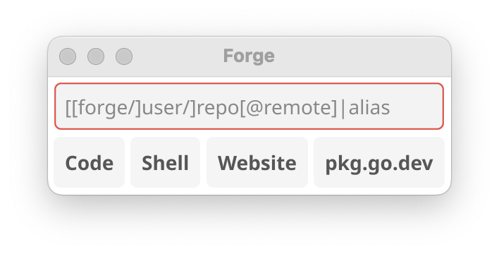

# forge

forge is a simple utility to clone and open local and remote git repos.

forge is primarily designed for my personal workflow, but might be useful to
others who use VSCode, work on multiple GitHub projects, and use VSCode's Remote
SSH extension. There are certainly many bugs.

## Configuration

Create `~/.config/forge/forge.toml` containing something like:

```toml
user = "YOUR_GITHUB_USERNAME"
editor = "code"
forge = "github.com"
sourceDir = "ABSOLUTE_PATH_TO_YOUR_HOME_DIRECTORY/src"
[remote.my-server]
    hostname = "my-server.example.com"
    sourceDir = "ABSOLUTE_PATH_TO_YOUR_HOME_DIRECTORY_ON_THIS_MACHINE/src"
[alias.my-project]
    repoDir = "PATH_TO_SOME_OTHER_DIR/my-project"
```

## Command line interface

`forge` clones or creates a repo if it does not exist and opens the working copy
in either VSCode or a shell.

    forge [flags] repo

    forge [flags] [[forge/]user/]repo[@remote]|alias

By default, `forge` will clone the repo if it does not already exist. Pass the
`-c` flag to create the repo instead of creating it.

Other flags control the action taken:

| flag | Action |
| - | - |
| none | Open the working copy in VSCode |
| `-s` | Open the working copy in a shell |
| `-w` | Open the project's repo in your web browser |
| `-d` | Open the project's documentation on pkg.go.dev in your web browser |

The syntax of `repo` is:

    [[forge/]user/]repo[@remote]|alias
    
`forge` defaults to `github.com`, `user` defaults to your GitHub username as
specified in the configuration file. The magic `user` value of `_` (a single
underscore) tells forge to find the unique repo in your source directory with
the given name. `_` is primarily useful for not having to type the full username
when you already know the repo name.

`@remote` allows you specify the machine for VSCodes' Remote SSH extension.
`remote` must be one of the remotes specified in your configuration file.

A single `alias` refers to an alias specified in your configuration file.

Personal examples with [my config
file](https://github.com/twpayne/dotfiles/blob/master/home/private_dot_config/forge/forge.toml.tmpl):

| `repo` argument   | Computed repo                                        |
| ----------------- | ---------------------------------------------------- |
| `chezmoi`         | `github.com/twpayne/chezmoi` on the local machine    |
| `google/renameio` | `github.com/google/renameio` on the local machine    |
| `_/renameio`      | `github.com/google/renameio` on the local machine    |
| `go-geos@legion`  | `github.com/twpayne/go-geos` on the machine `legion` |

## Graphical user interface

`forge-gui` is a simple GUI using [Fyne](https://fyne.io/). It is designed to be
launched from a shortcut key (I use `CapsLock+J` with [this Hammerspoon
config](https://github.com/twpayne/dotfiles/commit/68a9663f5ae52c7347bf6a063438e1f5a457182a)).



Shortcuts:

| Key                | Action                                                             |
| ------------------ | ------------------------------------------------------------------ |
| `Escape`           | Quit                                                               |
| `Enter` or `Alt+C` | Open the working copy in VSCode                                    |
| `Alt+S`            | Open the working copy in a shell                                   |
| `Alt+W`            | Open the project's repo in your web browser                        |
| `Alt+P`            | Open the project's documentation on pkg.go.dev in your web browser |

## License

MIT
